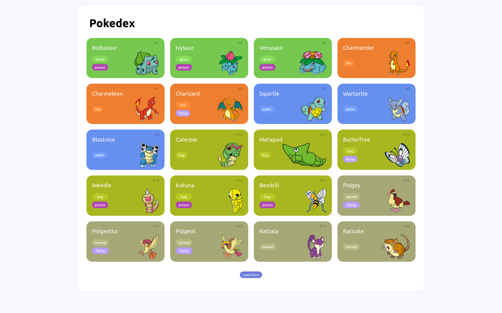

# Pokedex

 
 

  
   

# Índice

- [Descrição do Projeto](#descrição-do-projeto)
- [Tecnologias utilizadas](#tecnologias-utilizadas)
- [Autor](#author)

# Descrição do Projeto

Uma página Pokedex que mostra todos os pokemons da 2º geração, seu tipo e imagem. Usando a API Pokeapi.

# Tecnologias utilizadas

- Javascript
- HTML
- CSS
- PokeApi
- Git e Github

# Autor

 Paloma Santos Ferreira 
